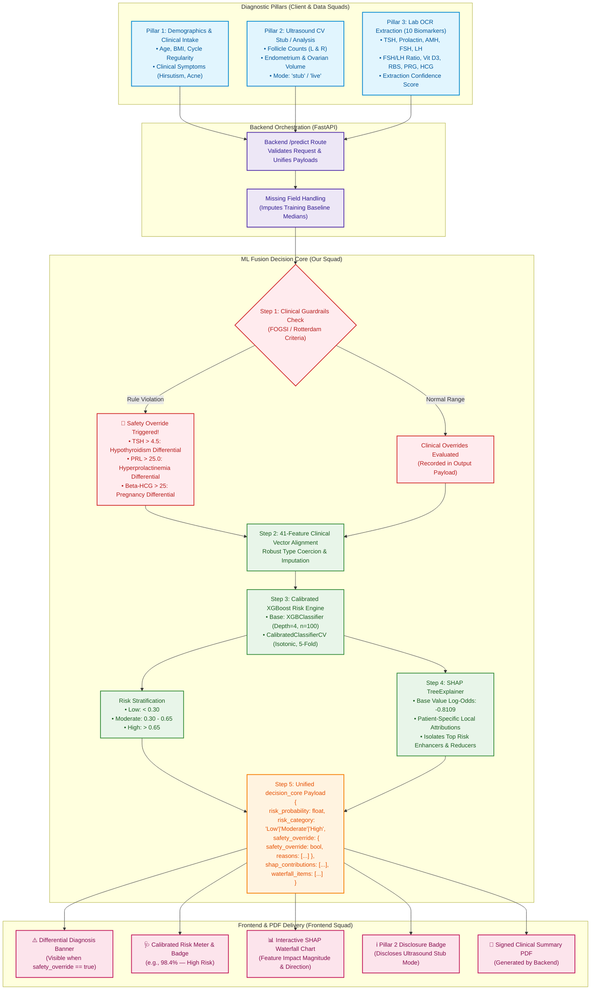

# Project MediLong — Clinical Decision Core 🩺⚡

[](https://www.python.org/)
[](https://xgboost.readthedocs.io/)
[](https://scikit-learn.org/)
[](https://shap.readthedocs.io/)
[](https://fastapi.tiangolo.com/)
[](https://www.fogsi.org/)

---

## 📌 Executive Summary

**Project MediLong** is an end-to-end multimodal clinical intelligence platform for Polycystic Ovary Syndrome (PCOS) risk screening, diagnosis assistance, and explainable reporting. 

The **ML Fusion & Clinical Safety Squad** owns the **`decision_core`** contract slice. This module sits at the predictive heart of MediLong, combining:
1. **Deterministic Clinical Safety Guardrails**: Pre-model clinical veto rules conforming to **FOGSI** (*Federation of Obstetric and Gynaecological Societies of India*) and **Rotterdam Consensus** diagnostic criteria.
2. **Calibrated Machine Learning Engine**: An ensemble **XGBoost** classifier calibrated via **Isotonic Regression** to produce statistically valid, continuous risk probabilities rather than heuristic or distorted scores.
3. **Local Explainability Layer**: **SHAP** (*SHapley Additive exPlanations*) TreeExplainer producing exact patient-level biomarker attributions for dynamic waterfall and bar charts in the frontend clinical dashboard.

---

## 🏢 Squad Ecosystem & Ownership Boundaries

```
┌──────────────────────────────────────────────────────────────────────────────┐
│                              PROJECT MEDILONG                                │
├────────────────────────┬─────────────────────────────────────────────────────┤
│ Squad                  │ Contract Slice / Core Responsibilities             │
├────────────────────────┼─────────────────────────────────────────────────────┤
│ 🛡️ ML Fusion & Safety  │ decision_core (risk_probability, risk_category,     │
│    (Deepak, Manoj,     │                safety_override, shap_contributions)│
│     Nambi)             │                                                     │
├────────────────────────┼─────────────────────────────────────────────────────┤
│ ☁️ Backend & Cloud     │ Orchestrates /predict, Firebase persistence, signed │
│    (Sridhar, Murasoli, │ PDF summary generator, unified JSON contract schema │
│     Kamalesh G)        │                                                     │
├────────────────────────┼─────────────────────────────────────────────────────┤
│ 🔬 Data Pipelines      │ pillar_2_ultrasound (follicles, volume, stub mode)  │
│    (Mani, Keerthi,     │ pillar_3_labs (10 biomarkers + source confidence)   │
│     Kamalesh C)        │                                                     │
├────────────────────────┼─────────────────────────────────────────────────────┤
│ 💻 Frontend & UI/UX    │ Multi-step intake UI, SHAP waterfall chart,         │
│    (Maadhesh, Kishore, │ safety override alert banner, stub disclosure       │
│     Sanjeevram,        │                                                     │
│     Adithyan)          │                                                     │
└────────────────────────┴─────────────────────────────────────────────────────┘
```

---

## 🔄 End-to-End System Flowchart (Mermaid)

The following flowchart details how patient information flows from the **Three Diagnostic Pillars**, through **Backend Orchestration**, into the **ML Fusion Decision Core**, and out to the **Frontend Dashboard**:



---

## 📊 Comprehensive Model Metrics & Evaluation

The predictive engine was trained on the validated **Kaggle Indian PCOS Dataset (541 patients, 41 clinical features)** using an 80/20 stratified train-test split (`random_state=44`).

### 1. Dataset Breakdown
* **Total Patients**: 541
* **Training Cohort**: 432 patients (80%)
* **Test Cohort**: 109 patients (20%)
* **Target Class Distribution**:
  * **Non-PCOS (0)**: 364 patients (67.28%)
  * **PCOS Positive (1)**: 177 patients (32.72%)

---

### 2. Primary Classification Metrics (Test Set Evaluation)

| Class | Clinical Status | Precision | Recall | F1-Score | Test Support |
| :---: | :--- | :---: | :---: | :---: | :---: |
| **0** | Non-PCOS | **0.88** | **0.95** | **0.91** | 73 |
| **1** | PCOS Positive | **0.87** | **0.75** | **0.81** | 36 |
| **Accuracy** | *Overall Model Accuracy* | — | — | **0.88** (88.07%) | **109** |
| **Macro Avg** | *Unweighted Average* | 0.88 | 0.85 | **0.86** | 109 |
| **Weighted Avg** | *Class-Weighted Average* | 0.88 | 0.88 | **0.88** | 109 |

---

### 3. Discrimination & Calibration Performance

| Metric | Score | Clinical Significance |
| :--- | :---: | :--- |
| **ROC-AUC Score** | **`0.9463`** | Exceptional discriminative ability between PCOS and non-PCOS cases. |
| **Calibration Method** | **Isotonic Regression** | Aligns predicted scores with true posterior empirical probabilities via 5-fold cross validation. |
| **Base Model** | **XGBoost Classifier** | `n_estimators=100`, `max_depth=4`, `eval_metric='logloss'`, `random_state=42`. |
| **Inference Latency** | **`< 70 ms`** | Sub-100ms execution, well within Backend's `< 3.0s` end-to-end latency budget. |

---

### 4. Deterministic Clinical Guardrails Rule Table

According to FOGSI and Rotterdam consensus guidelines, secondary endocrine etiologies that mimic PCOS must be screened out prior to confirming PCOS:

| Clinical Condition | Biomarker Rule | Trigger Threshold | Model Override Action | Recommended Clinical Differential |
| :--- | :--- | :--- | :--- | :--- |
| **Suspected Hypothyroidism** | Serum TSH | **`TSH > 4.5 mIU/L`** | Flags `safety_override: true` | Order full Thyroid profile (Free T3, Free T4, Anti-TPO antibodies). |
| **Suspected Hyperprolactinemia**| Serum Prolactin (PRL)| **`PRL > 25.0 ng/mL`** | Flags `safety_override: true` | Repeat fasting Prolactin; evaluate pituitary adenoma if persistent. |
| **Pregnancy Differential** | Serum Beta-HCG | **`Beta-HCG > 25.0 mIU/mL`**| Flags `safety_override: true` | Order confirmatory urine pregnancy test & obstetric ultrasound. |

---

### 5. Local Explainability (SHAP TreeExplainer)

SHAP attributions calculate the exact Shapley contribution of every clinical marker relative to the population base value:
* **Base Value (Starting Log-Odds)**: `E[f(x)] = -0.8109`
* **Top Clinical Risk Factors (Positive SHAP)**:
  * High Right/Left Follicle Count (`Follicle No. (R/L)`)
  * Rapid Weight Gain (`Weight gain (Y/N)`)
  * Elevated TSH / Hormonal Imbalance
  * Menstrual Irregularity (`Cycle (R/I)`)
* **Top Protective Factors (Negative SHAP)**:
  * Normal follicle distribution (< 8 follicles per ovary)
  * Absence of hirsutism (`hair growth: 0`)
  * Healthy waist-to-hip ratio

---

## 📦 Project Structure

```bash
medilong_decision_core/
├── data/
│   ├── PCOS_data_without_infertility.xlsx   # Full clinical dataset (Kaggle Indian PCOS)
│   └── PCOS_infertility.csv                 # Infertility clinical cohort
├── models/
│   ├── calibrated_model.joblib             # CalibratedClassifierCV (Isotonic)
│   ├── base_xgb.joblib                     # Standalone XGBoost model (for SHAP)
│   ├── feature_names.json                  # 41 feature canonical column list
│   ├── feature_medians.json                # Imputation baselines for missing labs
│   └── metrics.json                        # Serialized training and test metrics
├── notebooks/
│   └── 0_eda.ipynb                         # Exploratory data analysis & prototype
├── src/
│   ├── __init__.py
│   ├── train.py                            # Production training & artifact pipeline
│   └── decision_core.py                    # Multi-squad integration & FastAPI service
├── tests/
│   ├── __init__.py
│   └── test_decision_core.py               # Unit tests (Guardrails, Stub, Repro)
├── ML squad.pdf                            # ML Fusion & Safety Sprint Specification
├── backendsquad.pdf                        # Backend & Cloud API Contract Specification
├── datasquad.pdf                           # Data Pipelines (CV Stub & OCR) Specification
├── frontendsquad.pdf                       # Frontend UI & Explanation Widget Spec
├── requirements.txt                        # Project dependencies
└── README.md                               # System documentation & architectural guide
```

---

## 🚀 How to Integrate

### Option A: Python Module Import (Recommended for Backend `/predict`)

Backend squad can import the decision core directly into their FastAPI service:

```python
from src.decision_core import evaluate_patient, UnifiedIntakeRequest

# 1. Provide either 3-pillar JSON payload or dictionary
patient_payload = {
    "pillar_1_demographics": {
        "age": 26,
        "weight_kg": 68,
        "height_cm": 160,
        "cycle_ri": 4,              # Irregular
        "weight_gain": 1,
        "hair_growth": 1
    },
    "pillar_2_ultrasound": {
        "mode": "stub",
        "follicle_count": 18,
        "confidence": 0.88
    },
    "pillar_3_labs": {
        "tsh_miu_l": 6.2,           # Triggers Hypothyroidism override
        "prl_ng_ml": 18.0,
        "amh_ng_ml": 8.4
    }
}

# 2. Evaluate
decision_result = evaluate_patient(patient_payload)
print(decision_result["risk_category"])     # 'High'
print(decision_result["safety_override"])   # {'safety_override': True, 'reasons': [...]}
```

---

### Option B: Mount as FastAPI Router

Mount directly into an existing FastAPI application:

```python
from fastapi import FastAPI
from src.decision_core import router as decision_core_router

app = FastAPI(title="MediLong Core API")
app.include_router(decision_core_router, prefix="/api/v1")
```

---

### Option C: Run Standalone Decision Microservice

To run the standalone Decision Core server:

```powershell
uvicorn src.decision_core:app --host 0.0.0.0 --port 8000 --reload
```

Interactive Swagger documentation is available at: `http://localhost:8000/docs`

---

## 🧪 Running Tests & Retraining

### Run Unit Tests
```powershell
python -m unittest discover tests
```
*Validates: Independent guardrail override logic, 3-pillar schema parsing, missing biomarker median imputation, and output reproducibility.*

### Retrain Model & Regenerate Artifacts
```powershell
python src/train.py
```
*Executes: Data cleaning, 5-fold isotonic calibration, metric calculation, and artifact persistence to `models/`.*

---

## 👥 Authors & Team Contributions
* **Deepak** — *ML Fusion & Clinical Safety Squad Lead*
* **Manoj & Nambi** — *ML Modeling & Guardrail Research*
* In collaboration with:
  * **Backend & Cloud Squad**: Sridhar, Murasoli, Kamalesh G
  * **Data Pipelines Squad**: Mani, Keerthi, Kamalesh C
  * **Frontend & UI/UX Squad**: Maadhesh, Sanjeevram, Adithyan, Kishore
